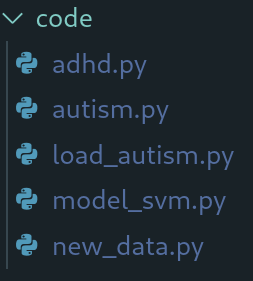
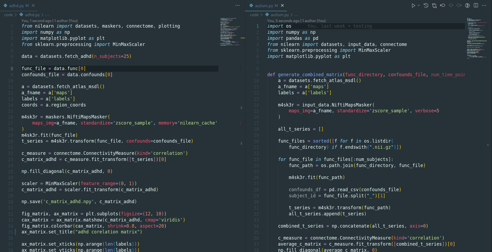

# NPA

## main components 

load_autism.py: load the autism group;

autism.py: similar to the above but for the autism group;

adhd.py: generates the connectivity matrix for the subjects to train the machine;

model_svm.py: after training with the two connectivity matrices (adhd + autism), generates predictions from another matrix of an unknown group;

new_data.py: preprocesses and calculates the matrix that needs to be predicted.

## structure
### training

these two main files are extremely important as they provide the 'food' to feed the support vector machine.

in this case, we are using only 25 subjects from each condition to extract connectivity.
>ps: you don't need to run those files to use the system, only the load_autism.py.

