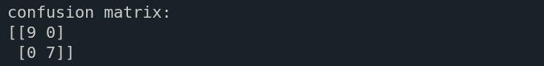

# neural patterns analyzer

## main components 

load_autism.py: load the autism group;

autism.py: similar to the above but for the autism group;

adhd.py: generates the connectivity matrix for the subjects to train the machine;

model_svm.py: after training with the two connectivity matrices (adhd + autism), generates predictions from another matrix of an unknown group;

new_data.py: preprocesses and calculates the matrix that needs to be predicted.

## structure
### training

these two main files are extremely important as they provide the 'food' to feed the support vector machine.

in this case, we are using only 25 subjects from each condition to extract connectivity.
>ps: you don't need to run those files to use the system, only the load_autism.py.

### testing

as previously described, the new_data.py will normalize the undiognosed file, calculate the connectivity of the regions and put this on a file called 'c_matrix_unknown.npy'.

we can't see our .npy matrix because it's encoded, but it looks something like this:

each label means a functional brain region, we have sort of a dictionary that help us understand what a connectivity matrix actually is:

### classifying

so, intuitively saying, when region 1 and region 2 have an 0.89 of strength connectivity (in a 0 - 1 scale, 0 meaning weak and 1 strong), the model compares with the same context regions in order to calculate the probability of pertencing to the adhd or autism group.

before run the code, does not do any harm verify if the inputs are set correctly:

then if you're using vscode, just right click the run button

# the results

## analyzing

the ADHD group is assigned the flag 0, while the autism group is assigned the flag 1;

given our knowlegde of the unknown matrix generated (with 1 adhd subject), we confidently assert that our system has accurately performed the classification:

